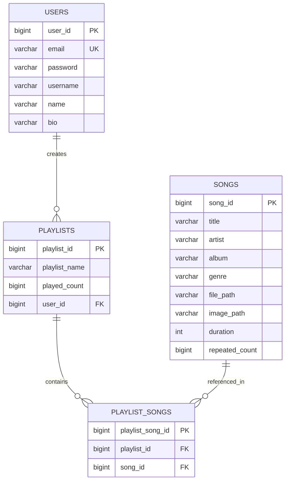

# 🎵 Aura Music Player

Aura is a modern, responsive, and premium web-based music streaming application built using Spring Boot, Hibernate, MySQL, Thymeleaf, and Bootstrap. It allows users to register, sign in, manage their personal queue, customize playlists, search for tracks, and listen to music with advanced player features like shuffle, repeat, and volume control.

---

## 🚀 Key Features

- **👤 User Management**:
  - Secure registration and login flow.
  - Profile customization (update profile info, custom bio, password change).
- **🎶 Interactive Media Player**:
  - Play, pause, skip, and go back to previous tracks.
  - Active playback queue management.
  - Advanced playback options: Shuffle and Repeat.
  - Custom progress tracking with synchronized seekable progress bar.
- **📁 Playlists & Favorites**:
  - Automatically generated "FavouriteList" for liked songs.
  - Create and manage custom playlists.
  - Track count and played-count stats.
- **🔍 Advanced Search**:
  - Find songs instantly by title, artist, or genre.
- **🎨 Premium Dark UI**:
  - Smooth glassmorphism, responsive grids, sleek background gradients, and micro-animations for hover states.

---

## 🛠️ Tech Stack

- **Backend Framework**: [Spring Boot 3.5.14](file:///c:/Aura/aura/aura/pom.xml) (Java 25)
- **Database / ORM**: MySQL & Spring Data JPA (Hibernate)
- **Templating Engine**: Thymeleaf (HTML5 integration)
- **Frontend Assets**: Custom Javascript ([player.js](file:///c:/Aura/aura/aura/src/main/resources/static/player.js)), CSS3, [Bootstrap v5.3.3](file:///c:/Aura/aura/aura/src/main/resources/templates/index.html), and Font Awesome icons.
- **Build Tool**: Maven

---

## 📂 Project Directory Structure

```text
aura/
├── aura/                           # Main spring boot project
│   ├── src/main/java/com/beats/    # Java backend source code
│   │   ├── controller/             # REST & MVC controllers (e.g. PlayerController, MusicController)
│   │   ├── model/                  # JPA Entities (Users, Songs, Playlists, PlaylistSongs)
│   │   ├── repository/             # Spring Data JPA repositories
│   │   ├── services/               # Core business logic services
│   │   └── AuraApplication.java    # Application entry point
│   ├── src/main/resources/
│   │   ├── static/                 # Static assets (JS, CSS, images, audio files)
│   │   │   ├── player.js           # Core music player frontend logic
│   │   │   └── songs/              # Audio file folder (.mp3)
│   │   ├── templates/              # Thymeleaf HTML views
│   │   └── application.yml         # Spring Boot configuration (Port, DataSource, Thymeleaf)
│   ├── pom.xml                     # Maven dependencies & build configuration
│   └── mvnw / mvnw.cmd             # Maven wrappers
└── aura_db.sql                     # Database schema dump & sample data seed
```

---

## 📊 Database Schema (Relational Model)

The database schema, defined in [aura_db.sql](file:///c:/Aura/aura/aura_db.sql), consists of four main tables:



---

## ⚙️ Local Setup & Running Guide

### 1. Prerequisites
- **Java Development Kit (JDK)**: Version 25 or higher.
- **MySQL Database Server**: Version 8.0 or higher.
- **Maven**: Installed and configured (or use the included wrapper `./mvnw`).

### 2. Database Setup
1. Open your MySQL client (e.g., MySQL Workbench, command line, etc.).
2. Create a database named `demo`:
   ```sql
   CREATE DATABASE demo;
   ```
3. Import the schema and seed data from [aura_db.sql](file:///c:/Aura/aura/aura_db.sql):
   ```bash
   mysql -u root -p demo < aura_db.sql
   ```

### 4. Application Configuration
Open [application.yml](file:///c:/Aura/aura/aura/src/main/resources/application.yml) and update your database credentials if necessary:
```yaml
spring:
  datasource:
    url: jdbc:mysql://localhost:3306/demo
    username: your_mysql_username
    password: your_mysql_password
```

### 5. Running the Application
From the `aura/aura/` directory, execute:
```bash
./mvnw spring-boot:run
```
Alternatively, import the project into your favorite IDE (IntelliJ IDEA, Eclipse, or VS Code) as a Maven project and run [AuraApplication.java](file:///c:/Aura/aura/aura/src/main/java/com/beats/AuraApplication.java).

### 6. Accessing the Application
Once the application starts, navigate to:
[http://localhost:9090/usr/loginPage](http://localhost:9090/usr/loginPage)

- **Default Test User**:
  - **Username**: `praksh1`
  - **Password**: `123123123`

---

## 🧪 Application Architecture & Control Flow

1. **Routing and Page Rendering**:
   - Page requests are handled by [MusicController](file:///c:/Aura/aura/aura/src/main/java/com/beats/controller/MusicController.java), fetching templates from the `/templates` folder.
2. **REST API endpoints**:
   - The interactive music player relies on AJAX calls (using `fetch` API inside [player.js](file:///c:/Aura/aura/aura/src/main/resources/static/player.js)) hitting [PlayerController](file:///c:/Aura/aura/aura/src/main/java/com/beats/controller/PlayerController.java) endpoints (`/api/songs/next`, `/api/songs/previous`, `/api/queue/add`, etc.).
3. **Session-based Playback Queue**:
   - The user's active playback queue and search/playback index are maintained directly in the HTTP servlet session to enable persistent listening state across navigation.
